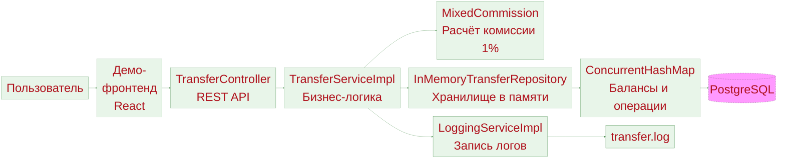

# Конфигурационные файлы все настроенно несомненно работает.

Kibana - не получается поднять так как падает Elasticsearch или что еще на моменте Дашборда, логи были но нет Дашборда. 
По техническим причинам * (Ноутбук не тянет в данный момент) * не получается задание исполнить все но есть 
конфигурационные файлы все настроенно работает. В этих логах вроде нету больше сообщений от Kibana. Решено прекратить попытки много уходит времени.

